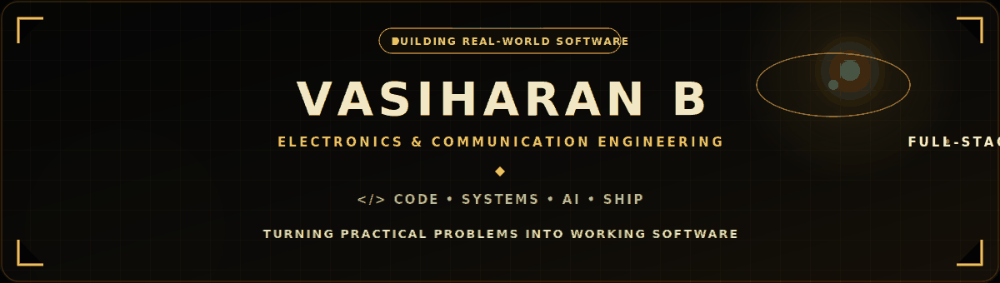
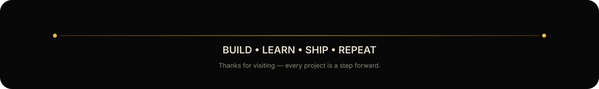

  

  
  &nbsp;
  
  &nbsp;
  
  &nbsp;
  

  

---

<h2 align="center">✦ ABOUT THE BUILDER ✦</h2>

  

  I'm <b>Vasiharan B</b>, an Electronics &amp; Communication Engineering student and full-stack developer based in Chennai, India. 
  I enjoy building practical software across <b>web platforms, business systems, AI-assisted applications, and immersive interfaces</b>.

  
  

<table width="100%" align="center">
<tr>
<td width="50%" align="center" style="padding:18px">
  <h4>⚙️ ENGINEERING MINDSET</h4>
  Build the system. Understand the flow. Ship the product.
</td>
<td width="50%" align="center" style="padding:18px">
  <h4>🧠 CURRENT DIRECTION</h4>
  Full-stack engineering, applied AI, architecture &amp; problem solving.
</td>
</tr>
</table>

---

<h2 align="center">✦ PROJECT CINEMA ✦</h2>

<table width="100%" align="center">
<tr>
<td width="50%" valign="top" style="padding:18px">

### 🏗️ JGC Construction ERP
Enterprise-style construction management covering CRM, projects, inventory, procurement and HR attendance workflows.

<b>PHP • MySQL • JavaScript • ERP • RBAC</b>

<a href="https://github.com/VasiharanB/jgc_constructions">ENTER PROJECT →</a>

</td>
<td width="50%" valign="top" style="padding:18px">

### 🤖 Smart Issue Tracker
Hybrid duplicate-ticket detection using semantic embeddings, FAISS retrieval and Gemini verification.

<b>React • TypeScript • Django • PostgreSQL • FAISS • Gemini</b>

<a href="https://github.com/VasiharanB/Smart-Issue-Tracker">ENTER PROJECT →</a>

</td>
</tr>
<tr>
<td width="50%" valign="top" style="padding:18px">

### 🪐 VYRA
Immersive portfolio experience built around futuristic interaction, motion, and visual storytelling.

<b>Interactive UI • Motion • Experience Design</b>

<a href="https://github.com/VasiharanB/VYRA-Portfolio-">ENTER PROJECT →</a>

</td>
<td width="50%" valign="top" style="padding:18px">

### 🚀 Aethon AI
Placement preparation and assessment platform with student/admin workflows, analytics, AI-assisted features and assessment monitoring.

<b>React • Vite • Node.js • Express • MySQL</b>

<a href="https://github.com/VasiharanB/aethon-ai">ENTER PROJECT →</a>

</td>
</tr>
</table>

---

<h2 align="center">✦ TECHNICAL ARSENAL ✦</h2>

  

  

  

---

<h2 align="center">✦ GITHUB ACTIVITY CORE ✦</h2>

  
  

  

---

<h2 align="center">✦ CONTRIBUTION JOURNEY ✦</h2>

  

---

<h2 align="center">✦ CONNECT ✦</h2>

  
  &nbsp;&nbsp;
  
  &nbsp;&nbsp;
  

  Open to building useful software, learning with strong engineering teams, and shipping meaningful products.

  

